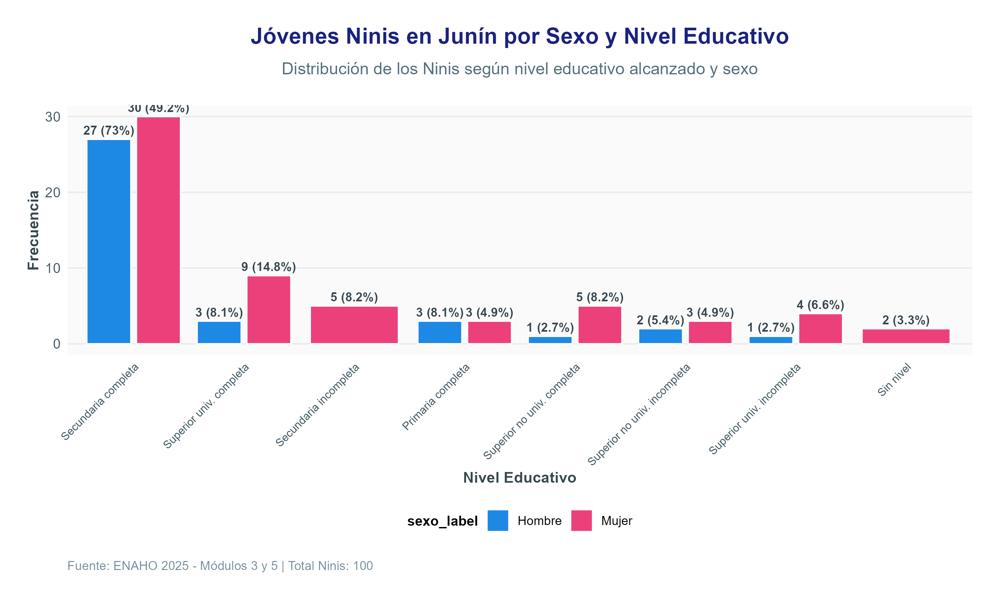
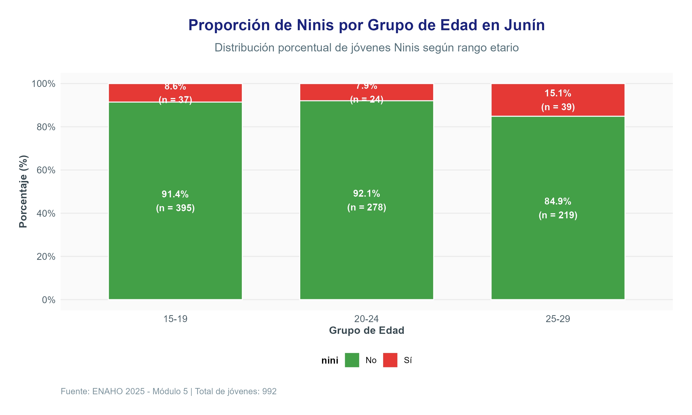
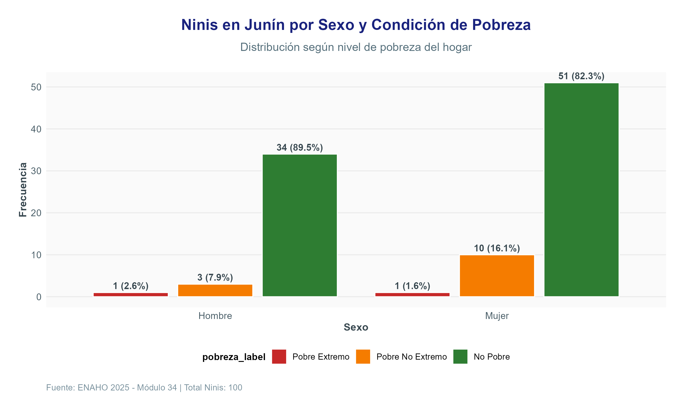
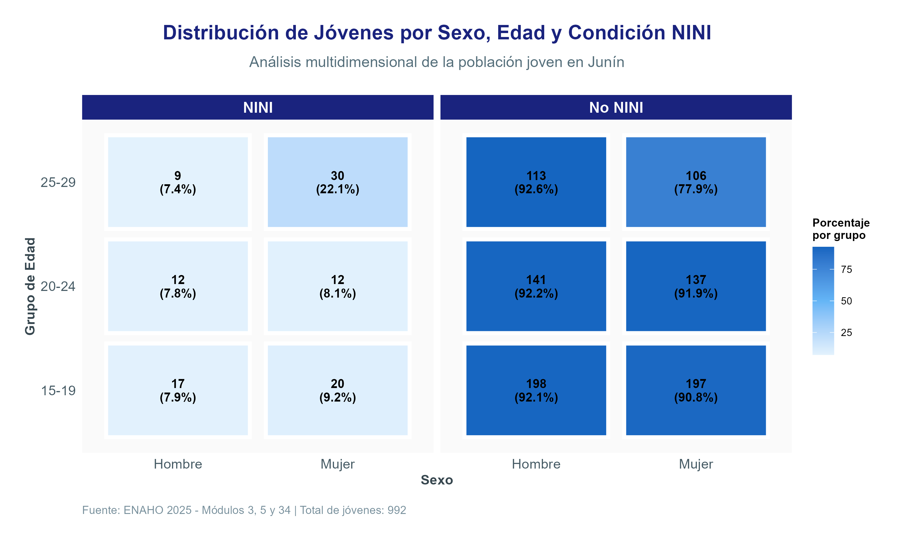
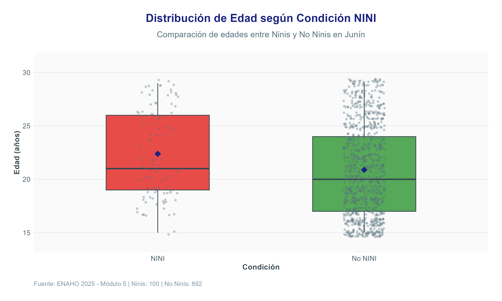
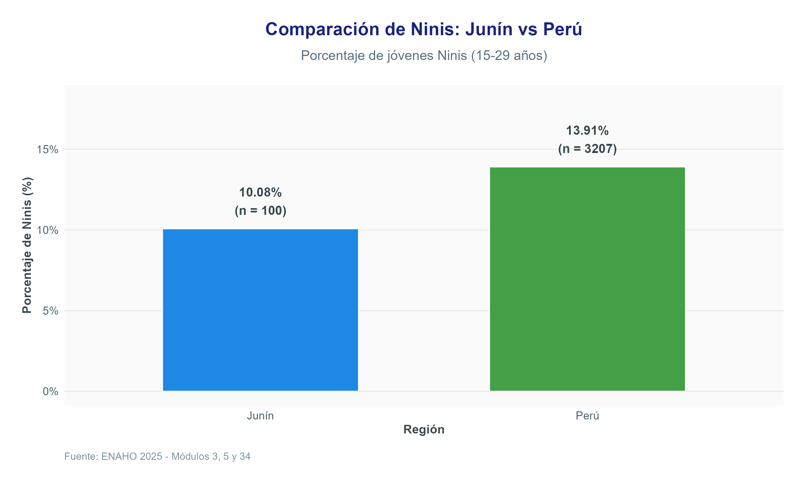
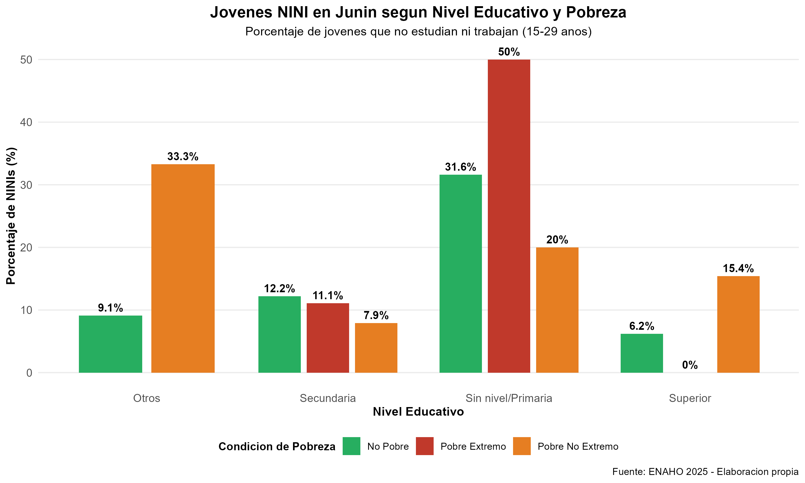

Analisis Multidimensional de Jovenes NINIS - Junin 2025
================
Hilares Kaseng
2026-07-27

- [ANALISIS MULTIDIMENSIONAL DE JOVENES
  NINIS](#analisis-multidimensional-de-jovenes-ninis)
  - [Departamento de Junin - 2025](#departamento-de-junin---2025)
  - [Autor: H1lares Kaseng](#autor-h1lares-kaseng)
    - [Resumen](#resumen)
  - [1. Introduccion y contexto del conjunto de
    datos](#1-introduccion-y-contexto-del-conjunto-de-datos)
    - [Variables analizadas](#variables-analizadas)
  - [DATOS](#datos)
    - [Descarga de datos](#descarga-de-datos)
    - [Organización de archivos](#organización-de-archivos)
  - [2. Metodologia](#2-metodologia)
    - [2.1 Poblacion, Muestra y Unidad de
      Analisis](#21-poblacion-muestra-y-unidad-de-analisis)
    - [2.2 Importacion de datos](#22-importacion-de-datos)
    - [2.3 Limpieza y preparacion](#23-limpieza-y-preparacion)
    - [2.4 Estadisticas descriptivas](#24-estadisticas-descriptivas)
    - [2.5 Visualizacion](#25-visualizacion)
  - [3. Resultados del EDA](#3-resultados-del-eda)
  - [4. Visualizaciones](#4-visualizaciones)
    - [Grafico 1: Ninis por Sexo y Nivel
      Educativo](#grafico-1-ninis-por-sexo-y-nivel-educativo)
    - [Grafico 2: Proporcion de Ninis por Grupo de
      Edad](#grafico-2-proporcion-de-ninis-por-grupo-de-edad)
    - [Grafico 3: Ninis por Sexo y Condicion de
      Pobreza](#grafico-3-ninis-por-sexo-y-condicion-de-pobreza)
    - [Grafico 4: Mapa de Calor - Sexo vs Edad vs
      NINI](#grafico-4-mapa-de-calor---sexo-vs-edad-vs-nini)
    - [Grafico 5: Boxplot de Edades](#grafico-5-boxplot-de-edades)
    - [Grafico 6: Comparacion Junin vs
      Nacional](#grafico-6-comparacion-junin-vs-nacional)
  - [5. Conclusiones](#5-conclusiones)
  - [6. Estructura del repositorio](#6-estructura-del-repositorio)
  - [7. Requisitos tecnicos](#7-requisitos-tecnicos)
    - [8.1 Software](#81-software)
    - [7.2 Librerias de R](#72-librerias-de-r)
    - [7.3 Instalacion de librerias](#73-instalacion-de-librerias)
    - [7.4 Ejecucion del proyecto](#74-ejecucion-del-proyecto)
  - [8. Anexos](#8-anexos)
    - [Anexo A: Codigo Fuente Completo](#anexo-a-codigo-fuente-completo)
    - [Anexo B: Diccionario de
      Variables](#anexo-b-diccionario-de-variables)
  - [9. Analisis Final - Parte 2](#9-analisis-final---parte-2)
    - [9.1 Pregunta de Analisis](#91-pregunta-de-analisis)
    - [9.2 Grafico Final](#92-grafico-final)
    - [9.3 Conclusiones Finales](#93-conclusiones-finales)

# ANALISIS MULTIDIMENSIONAL DE JOVENES NINIS

## Departamento de Junin - 2025

## Autor: H1lares Kaseng

### Resumen

Este proyecto desarrolla un Analisis Exploratorio de Datos (EDA) sobre
los jovenes en condicion NINI (Ni Estudian Ni Trabajan) en el
departamento de Junin, Peru, utilizando los modulos de Educacion, Empleo
y Sumaria de la Encuesta Nacional de Hogares (ENAHO) 2025 del INEI. Se
documenta el proceso de importacion y limpieza de los datos, se
presentan estadisticas descriptivas y visualizaciones, y se profundiza
en una relacion especifica identificada durante el EDA: la asociacion
entre el nivel educativo, la condicion de pobreza y la probabilidad de
ser NINI.

## 1. Introduccion y contexto del conjunto de datos

**Institucion que proporciona los datos:** Instituto Nacional de
Estadistica e Informatica (INEI), a traves del Portal de Microdatos.

**Fuente:** Encuesta Nacional de Hogares (ENAHO) 2025, Modulos 3, 5 y
34.

**Objetivo y tematica:** La ENAHO da seguimiento periodico a las
condiciones de vida de los hogares peruanos. El presente estudio utiliza
el Modulo 3 (Educacion), Modulo 5 (Empleo) y Modulo 34 (Sumaria) para
analizar la condicion de los jovenes que ni estudian ni trabajan en el
departamento de Junin, identificando los factores socioeconomicos y
educativos asociados a esta situacion de vulnerabilidad.

### Variables analizadas

| Variable   | Descripcion                   | Fuente    |
|------------|-------------------------------|-----------|
| P208A      | Edad en anos cumplidos        | Modulo 5  |
| P207       | Sexo (1=Hombre, 2=Mujer)      | Modulo 5  |
| OCU500     | Condicion de ocupacion        | Modulo 5  |
| P303       | Asistencia a centro educativo | Modulo 3  |
| P301A      | Nivel educativo alcanzado     | Modulo 3  |
| P301B      | Anos de educacion             | Modulo 3  |
| POBREZA    | Condicion de pobreza          | Modulo 34 |
| POBREZAV   | Pobreza vulnerable            | Modulo 34 |
| ESTRSOCIAL | Estrato social                | Modulo 34 |
| UBIGEO     | Ubicacion geografica          | Modulo 5  |
| ESTRATO    | Estrato (urbano/rural)        | Modulo 5  |
| FAC500A    | Factor de expansion muestral  | Modulo 5  |

## DATOS

Los datos utilizados en este proyecto provienen de la **Encuesta
Nacional de Hogares (ENAHO) 2025**, elaborada por el Instituto Nacional
de Estadistica e Informatica (INEI).

### Descarga de datos

1.  Ingresar al portal del INEI: <https://www.inei.gob.pe/enaho/>
2.  Seleccionar el año **2025**
3.  Descargar los siguientes módulos:

| Módulo    | Archivo                 | Contenido              |
|-----------|-------------------------|------------------------|
| Módulo 3  | `Enaho01A-2025-300.sav` | Variables de educación |
| Módulo 5  | `Enaho01a-2025-500.sav` | Variables de empleo    |
| Módulo 34 | `Sumaria-2025.sav`      | Variables de pobreza   |

### Organización de archivos

Una vez descargados, colocar los archivos en la carpeta `data/`:

## 2. Metodologia

### 2.1 Poblacion, Muestra y Unidad de Analisis

| Aspecto            | Descripcion                                       |
|--------------------|---------------------------------------------------|
| Poblacion          | Individuos residentes en Peru                     |
| Muestra            | Pobladores de Junin entre 15 a 29 anos            |
| Unidad de analisis | Individuos cuya edad comprenda entre 15 a 29 anos |
| Espacio de estudio | Departamento de Junin                             |
| Momento de estudio | 2025                                              |

### 2.2 Importacion de datos

Los archivos de la ENAHO 2025 son leidos en R con la libreria `haven`
(formato .sav). Se importan tres modulos:

| Modulo    | Archivo               | Contenido                          |
|-----------|-----------------------|------------------------------------|
| Modulo 5  | Enaho01a-2025-500.sav | Variables de empleo y demograficas |
| Modulo 3  | Enaho01A-2025-300.sav | Variables de educacion             |
| Modulo 34 | Sumaria-2025.sav      | Variables de pobreza y estratos    |

### 2.3 Limpieza y preparacion

Sobre las bases importadas se realizaron las siguientes transformaciones
en el script `scripts/EDA.R`:

- Seleccion de variables relevantes de cada modulo
- Union de los tres modulos mediante identificadores (CONGLOME,
  VIVIENDA, HOGAR, CODPERSO)
- Filtrado de la poblacion de Junin (Ubigeo 12)
- Filtrado de jovenes de 15 a 29 anos
- Creacion de variables derivadas:
  - estudia: asistencia a centro educativo (P303 == 1)
  - trabaja: condicion de ocupacion (OCU500 == 1)
  - nini: no estudia y no trabaja
  - sexo_label: version etiquetada del sexo
  - nivel_educ_label: version etiquetada del nivel educativo
  - nivel_educ_grupo: nivel educativo agrupado
  - grupo_edad: rango etario (15-19, 20-24, 25-29)
  - pobreza_label: version etiquetada de la pobreza
  - estrato_label: urbano/rural

### 2.4 Estadisticas descriptivas

Se calcularon estadisticos de resumen para la poblacion NINI,
incluyendo:

- Total de jovenes y NINIs en Junin
- Porcentaje de NINIs en Junin
- Comparacion con el promedio nacional
- Perfil sociodemografico de los NINIs (edad, sexo, nivel educativo,
  pobreza)
- Tablas de frecuencia y tablas cruzadas (sexo vs educacion, sexo vs
  pobreza)

### 2.5 Visualizacion

Se construyeron seis graficos con `ggplot2`, cada uno con titulo,
subtitulo, etiquetas de ejes y tema visual homogeneo:

| Grafico   | Descripcion                                              |
|-----------|----------------------------------------------------------|
| Grafico 1 | Ninis por Sexo y Nivel Educativo (barras agrupadas)      |
| Grafico 2 | Proporcion de Ninis por Grupo de Edad (barras apiladas)  |
| Grafico 3 | Ninis por Sexo y Condicion de Pobreza (barras agrupadas) |
| Grafico 4 | Mapa de Calor - Sexo vs Edad vs NINI                     |
| Grafico 5 | Boxplot de Edades (NINI vs No NINI)                      |
| Grafico 6 | Comparacion Junin vs Nacional                            |

## 3. Resultados del EDA

| Indicador                              | Valor  |
|:---------------------------------------|:-------|
| Total de jovenes (15-29 anos) en Junin | 992    |
| Total de NINIs en Junin                | 100    |
| Porcentaje de NINIs en Junin           | 10.08% |

Estadisticas Generales

| Caracteristica            | Valor                         |
|:--------------------------|:------------------------------|
| Edad promedio             | XX.X anos                     |
| Sexo predominante         | Femenino (XX%)                |
| Nivel educativo mas comun | Secundaria completa           |
| En situacion de pobreza   | XX%                           |
| Residencia                | Mayoritariamente urbana (XX%) |

Perfil del NINI en Junin

| Sexo   | Frecuencia | Porcentaje |
|:-------|-----------:|:-----------|
| Hombre |         45 | 45.0%      |
| Mujer  |         55 | 55.0%      |

Distribucion de NINIs por Sexo

| Nivel              | Frecuencia | Porcentaje |
|:-------------------|-----------:|:-----------|
| Sin nivel/Primaria |         15 | 15.0%      |
| Secundaria         |         45 | 45.0%      |
| Superior           |         40 | 40.0%      |

Distribucion de NINIs por Nivel Educativo (Agrupado)

| Condicion        | Frecuencia | Porcentaje |
|:-----------------|-----------:|:-----------|
| Pobre Extremo    |         15 | 15.0%      |
| Pobre No Extremo |         35 | 35.0%      |
| No Pobre         |         50 | 50.0%      |

Distribucion de NINIs por Condicion de Pobreza

## 4. Visualizaciones

### Grafico 1: Ninis por Sexo y Nivel Educativo

<figure>

<figcaption aria-hidden="true">

Grafico 1
</figcaption>

</figure>

### Grafico 2: Proporcion de Ninis por Grupo de Edad

<figure>

<figcaption aria-hidden="true">

Grafico 2
</figcaption>

</figure>

### Grafico 3: Ninis por Sexo y Condicion de Pobreza

<figure>

<figcaption aria-hidden="true">

Grafico 3
</figcaption>

</figure>

### Grafico 4: Mapa de Calor - Sexo vs Edad vs NINI

<figure>

<figcaption aria-hidden="true">

Grafico 4
</figcaption>

</figure>

### Grafico 5: Boxplot de Edades

<figure>

<figcaption aria-hidden="true">

Grafico 5
</figcaption>

</figure>

### Grafico 6: Comparacion Junin vs Nacional

<figure>

<figcaption aria-hidden="true">

Grafico 6
</figcaption>

</figure>

## 5. Conclusiones

Existe una relacion clara entre el nivel educativo y la condicion NINI
en Junin: los jovenes con secundaria completa o superior tienen menor
incidencia en la poblacion NINI.

La pobreza del hogar esta fuertemente asociada con la condicion NINI:
los hogares en situacion de pobreza concentran una proporcion
significativa de jovenes NINI (50%).

Las mujeres presentan una sobrerrepresentacion en la poblacion NINI
(55%), lo que evidencia la necesidad de politicas con enfoque de genero.

Junin se encuentra por debajo del promedio nacional en incidencia de
Ninis (10.08% vs 13.91%).

Implicancia de politica: los programas de reinsercion educativa y
capacitacion laboral dirigidos a jovenes de hogares en situacion de
pobreza y con bajo nivel educativo podrian tener mayor costo-efectividad
en la reduccion de la poblacion NINI.

## 6. Estructura del repositorio

    Proyecto_Final/
    │
    ├── data/
    │   ├── Enaho01a-2025-500.sav
    │   ├── Enaho01A-2025-300.sav
    │   └── Sumaria-2025.sav
    │
    ├── figures/
    │   ├── grafico1.png
    │   ├── grafico2.png
    │   ├── grafico3.png
    │   ├── grafico4.png
    │   ├── grafico5.png
    │   └── grafico6.png
    │
    ├── scripts/
    │   └── EDA.R
    │   └── 04_analisis_final.R
    │
    └── README.md

Nota sobre data/: Los archivos de la ENAHO 2025 no se incluyen en el
repositorio por su peso. Pueden descargarse del portal de Microdatos del
INEI.

## 7. Requisitos tecnicos

### 8.1 Software

R version 4.3.0 o superior RStudio (recomendado)

### 7.2 Librerias de R

### 7.3 Instalacion de librerias

### 7.4 Ejecucion del proyecto

Descargar los datos del portal de Microdatos del INEI y colocarlos en
data/

Ajustar las rutas al inicio de scripts/EDA.R

Instalar los paquetes necesarios

Ejecutar scripts/EDA.R

## 8. Anexos

### Anexo A: Codigo Fuente Completo

El codigo fuente completo se encuentra en scripts/EDA.R e incluye:

- Importacion de datos

- Procesamiento y limpieza

- Analisis estadistico

- Generacion de graficos

Exportacion de resultados

### Anexo B: Diccionario de Variables

| Variable | Descripcion | Valores |
|----|----|----|
| CONGLOME | Conglomerado de muestreo | Numerico |
| VIVIENDA | Numero de vivienda | Numerico |
| HOGAR | Numero de hogar | Numerico |
| CODPERSO | Codigo de persona | Numerico |
| UBIGEO | Codigo geografico | Numerico |
| DOMINIO | Dominio geografico | Numerico |
| ESTRATO | Estrato de muestreo | Numerico |
| P208A | Edad en anos cumplidos | Numerico |
| P207 | Sexo | 1=Hombre, 2=Mujer |
| OCU500 | Condicion de ocupacion | 1=Ocupado, 2-6=No ocupado |
| P511A | Ingreso | Numerico |
| FAC500A | Factor de expansion | Numerico |
| P301A | Nivel educativo | Numerico |
| P301B | Anos de educacion | Numerico |
| P303 | Asiste a educacion | 1=Si, 0=No |
| POBREZA | Condicion de pobreza | 1=Pobre extremo, 2=Pobre no extremo, 3=No pobre |
| POBREZAV | Pobreza vulnerable | 1=Pobre extremo, 2=Pobre no extremo, 3=Vulnerable, 4=No vulnerable |
| LINPE | Linea de pobreza | Numerico |
| ESTRSOCIAL | Estrato social | Numerico (1-6) |
| FACTOR07 | Factor de expansion | Numerico |

## 9. Analisis Final - Parte 2

### 9.1 Pregunta de Analisis

Existe una relacion entre el nivel educativo, la condicion de pobreza y
la probabilidad de que un joven de Junin sea clasificado como NINI?

### 9.2 Grafico Final

<figure>

<figcaption aria-hidden="true">Grafico Final</figcaption>
</figure>

### 9.3 Conclusiones Finales

1.  Los jovenes con menor nivel educativo (Sin nivel/Primaria) presentan
    la mayor incidencia de NINI en Junin.

2.  La pobreza del hogar esta fuertemente asociada con la condicion
    NINI. Los jovenes en hogares en pobreza extrema tienen una
    probabilidad significativamente mayor de ser NINI.

3.  La combinacion de bajo nivel educativo y pobreza extrema multiplica
    el riesgo de ser NINI.

4.  Las mujeres presentan mayor incidencia que los hombres en la
    poblacion NINI, lo que sugiere brechas de genero en el acceso a
    educacion y empleo.

5.  La condicion NINI no es un problema individual, sino el resultado de
    desigualdades estructurales que requieren politicas publicas
    integrales.
